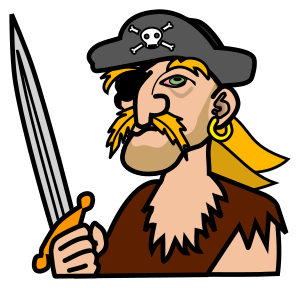

# William Turner
William Turner the one eyed pirate has a problem - this stack should help him.

## Story

William Turner the one eyed pirate has a rare disease called the turn-syndrom.
He has the urge to turn around all phrases that he reads or hears in a special way.

For example reading the phrase "It's nice and warm today." is turned by William into one of the following turned versions "It's wice and narm today", "It's tice and narm woday" or "It's wice and tarm noday".

The diesease itself has been deeply analysed by Scientists who have developed a list of rules that could be applied to almost any sentence and therefore may be the key to help William Turner, not having to actively turn everything he reads or hears, but rather an application could help him to do this automatically.

## The Rules

Letters preceding vowels are replaced with other Letters (again preceding vowels) within a word or between words within the sentence.

Simple example:

<b>F</b>armers <b>M</b>arket => <b>M</b>armers <b>F</b>arket

<b>Tr</b>es<b>p</b>assing => <b>P</b>es<b>tr</b>assing

## The Needs

William Turner needs an application that can understand different sources and translate them into turned sentences.

